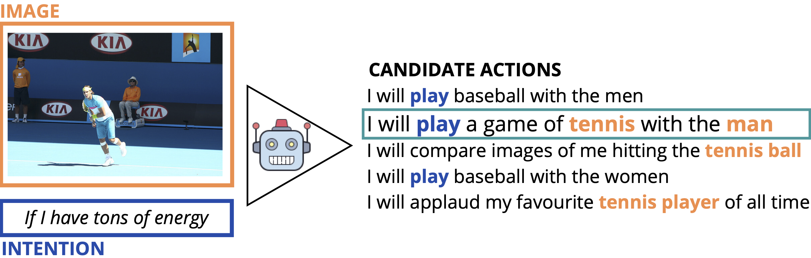

# Be Different to Be Better! A Benchmark to Leverage the Complementarity of Language and Vision

Website: [sites.google.com/view/bd2bb/](https://sites.google.com/view/bd2bb/home)

Code and data described in: Pezzelle, Greco, Gandolfi, Gualdoni, Bernardi (2020). [Be Different to Be Better! A Benchmark to Leverage the Complementarity of Language and Vision](https://www.aclweb.org/anthology/2020.findings-emnlp.248.pdf). Findings of EMNLP 2020



Cite:

```
@inproceedings{pezzelle-etal-2020-different,
    title = "{B}e {D}ifferent to {B}e {B}etter! {A} {B}enchmark to {L}everage the {C}omplementarity of {L}anguage and {V}ision",
    author = "Pezzelle, Sandro  and
      Greco, Claudio  and
      Gandolfi, Greta  and
      Gualdoni, Eleonora  and
      Bernardi, Raffaella",
    booktitle = "Findings of the Association for Computational Linguistics: EMNLP 2020",
    month = nov,
    year = "2020",
    address = "Online",
    publisher = "Association for Computational Linguistics",
    url = "https://www.aclweb.org/anthology/2020.findings-emnlp.248",
    pages = "2751--2767"
}
```

## Training LXMERT and RoBERTa
In order to train and evaluate models based on LXMERT and RoBERTa, you have to execute the following steps.

### I) Install the required dependencies
In order to install the required dependencies, you have to run the following commands:
1. virtualenv -p python3 venv_bd2bb
2. source venv_bd2bb/bin/activate
3. pip install -r requirements.txt
4. git clone https://github.com/airsplay/lxmert.git

### II) Convert MS-COCO Bottom-Up Attention features
LXMERT requires the MS-COCO Faster R-CNN Bottom-Up Attention features used in [1]. We load these features after having converted them in NumPy format, in order to load them more quickly than when they are in their original TSV format. In order to download and convert MS-COCO Bottom-Up Attention features, you have to run the following commands:
1. wget https://imagecaption.blob.core.windows.net/imagecaption/trainval_36.zip -P data
2. unzip data/trainval_36.zip
3. mv data/mscoco_imgfeat data/mscoco_features
4. python convert_mscoco_bottomup_features.py

### III) Training and evaluating models
In order to train LXMERT_LV, LXMERT_V, and RoBERTa_L, you have to run the command "python models/train_lxmert_lv.py", "python models/train_lxmert_v.py", and "python models/train_roberta_l.py", respectively. By default, the training scripts fine-tune the pre-trained models. In order to train the models from scratch, you have to run the training scripts with the "--from_scratch" argument. The trained model will be saved in the folder specified by the "--save_best_model_path" argument.

In order to evaluate LXMERT_LV, LXMERT_V, and RoBERTa_L, you have to run the command "python models/test_lxmert_lv.py", "python models/test_lxmert_v.py", and "python models/test_roberta_l.py", respectively. By default, the evaluation scripts compute the accuracy and the standard deviation across three runs of the model, whose path is defined by the "--load_model_filename" argument. For instance, if that argument is equal to "/bin/lxmert_LV/lxmert_run{}.model", then the script loads the models "/bin/lxmert_LV/lxmert_run1.model", "/bin/lxmert_LV/lxmert_run2.model", and "/bin/lxmert_LV/lxmert_run3.model". The number of runs is specified by the "--num_runs" argument.

The saved models that turned out to be best-performing in the paper can be found at [this link](https://drive.google.com/drive/folders/10VAS-QhlNcHfCv_te0dUGQeFDZC5ohAO?usp=sharing)


## Training Baselines
In order to train and evaluate the baselines, you have to execute the following steps.

### I) Install the required dependencies
In order to install the required dependencies, you have to run the following commands:
1. virtualenv -p python3 venv_bd2bb
2. source venv_bd2bb/bin/activate
3. pip install -r requirements.txt [note that the results for the baselines reported in the paper were obtained using Torch v1.4.0]

### II) Word embeddings
1. download GloVe embeddings from "http://nlp.stanford.edu/data/glove.6B.zip" [822MB]
2. unzip the folder and delete the .zip by: unzip glove.6B.zip && rm glove.6B.zip
3. in 'baselines/', make a new folder named 'glove.6B' and move all glove.6B*d.txt files into it: mv glove.6B*d.txt baselines/glove.6B/

### III) Image features, Option 1:
1. download ResNet101 features (and optionally ResNet152 features) from [this link](https://drive.google.com/drive/folders/10VAS-QhlNcHfCv_te0dUGQeFDZC5ohAO?usp=sharing) 
2. in 'baselines/', create a folder named 'resnet101' and move the .json features into it [for resnet152, make a folder named 'resnet152' and move the .h5 and .json files into it]

### III) Image features, Option 2:
1. download the images using the urls listed in 'data/IMG_urls.txt' into a new folder 'images/'; then, extract the ResNet101 features using 'baselines/utils/get_image_features.py'

### IV) Training and evaluating baselines
In order to train the baselines, simply run python train.py by specifying the desired arguments. To run the train the best-performing run of the multimodal baseline model, for example, run python train.py -manual_seed 21. You will obtain around 49.6 accuracy in validation, 50.04 in test set. To run, e.g., the only-vision version of the baseline with seed 42, run python train.py -setting only-vision. Note that for all baseline versions, the results reported in the paper were obtained with seeds 21, 42, and 2020.

In order to evaluate the trained baselines, simply run evaluate.py by using the argument -out_dir to specify the weigths you want to load. Weight are included in 'baselines/output/' and are in format .pt.


For questions, info, feedback please contact:
**s dot pezzelle at uva dot nl**


## References
[1] Anderson, Peter, et al. "Bottom-up and top-down attention for image captioning and visual question answering." Proceedings of the IEEE conference on computer vision and pattern recognition. 2018.
